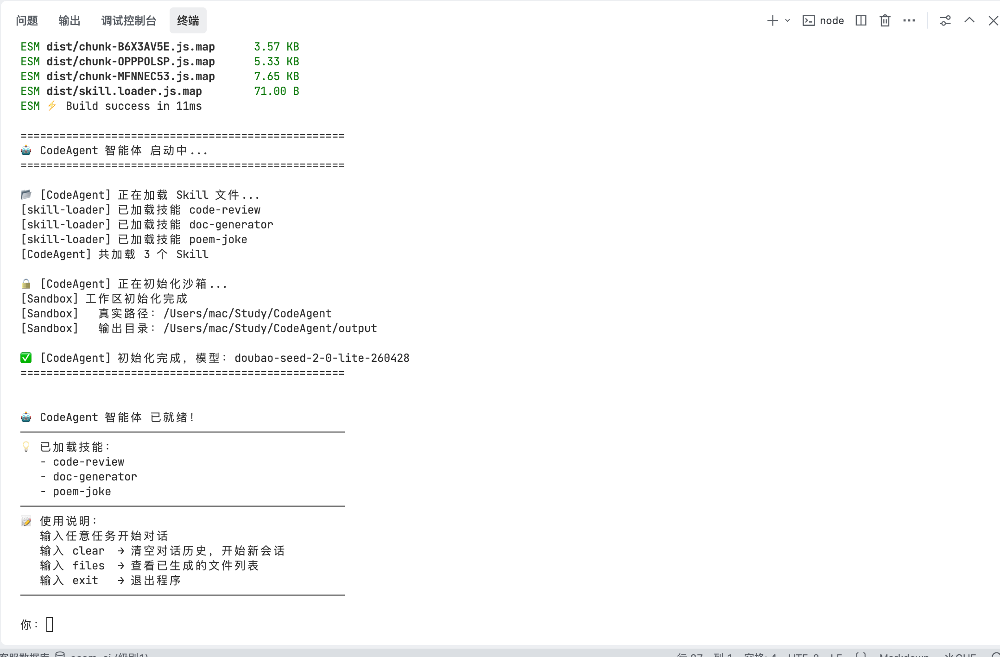

# CodeAgent

> 基于 **豆包（Doubao）** + TypeScript 的本地通用型 AI 代码智能体，对标 Claude Code / OpenAI Codex 产品形态。

## ✨ 特性

- 🧠 **默认接入豆包 Ark 大模型** — 火山引擎方舟平台，兼容 OpenAI API 协议，两行配置即可切换 DeepSeek / 通义 / Ollama 等其他模型
- 📦 **Skill 技能热插拔** — `.skill.md` 文件驱动，新增技能无需改代码，重启自动加载
- 🔒 **VFS 沙箱隔离** — 所有文件写操作限制在 `output/` 目录内，防止越界访问
- 🤝 **HITL 人机协同** — 高风险操作终端二次确认，同 Codex 设计理念
- 👥 **多智能体协作** — 子 Agent 并行分工（Researcher / Analyst / Writer），复杂任务分而治之
- 🔍 **联网搜索能力** — 集成 Tavily Search，支持实时信息检索
- 💬 **交互式对话** — 多轮对话、历史清空、文件列表查看，命令式操作

## 🏗️ 架构

```
┌─────────────────────────────────────────┐
│            交互式 CLI 入口               │  src/index.ts
├─────────────────────────────────────────┤
│              CodeAgent 核心              │  src/agent.ts
├───────┬────────┬────────┬───────────────┤
│ Skill │ Sandbox│  HITL  │  Multi-Agent  │  四大核心模块
│  技能  │  沙箱  │  人审  │   多智能体    │
├───────┴────────┴────────┴───────────────┤
│         OpenAI 兼容 SDK 调用层           │
├─────────────────────────────────────────┤
│  豆包 Ark (默认) / DeepSeek / Ollama ... │
└─────────────────────────────────────────┘
```

## 🚀 快速开始

### 环境要求

- Node.js >= 18
- 一个豆包 Ark API Key（[免费申请](https://console.volcengine.com/ark/)）

### 安装

```bash
# 克隆项目
git clone https://github.com/AgentSmallLee/CodeAgent.git
cd CodeAgent

# 安装依赖
npm install
```

### 配置

```bash
# 复制环境变量模板
cp .env.example .env
```

编辑 `.env`，填入豆包 Ark 的配置：

```env
# API Key（必填）
DOUBAO_API_KEY=你的豆包Ark_API_Key

# 模型接入点 ID（必填）
# 注意：豆包 Ark 的 model 参数填的是「接入点 ID」，不是模型名
# 接入点 ID 通常以 ep- 开头，在「模型推理 → 接入点管理」里创建
DOUBAO_MODEL=你的接入点ID

# API 端点（默认北京区域，可不改）
DOUBAO_BASE_URL=https://ark.cn-beijing.volces.com/api/v3

# 可选：Tavily 搜索 API Key（demo-search 需要）
TAVILY_API_KEY=tvly-xxx
```

> 💡 豆包 Ark 的模型接入点需要在控制台手动创建，选择「Doubao-Seed-2.1-Turbo」等模型后会生成一个 `ep-` 开头的接入点 ID。

### 运行

```bash
# 启动交互式 CodeAgent（主入口）
npm run dev
# 或
npm run codeAgent
```

启动后进入对话模式，输入任务即可：

```
你：帮我写一个快速排序的 TypeScript 实现
你：clear    # 清空对话历史
你：files    # 查看已生成的文件
你：exit     # 退出
```

### 运行效果



## 🎬 演示

项目内置了三个 Demo 脚本，可直接运行体验不同能力：

```bash
# 基础对话 Demo — 单轮问答
npm run demo:basic

# 联网搜索 Demo — Tavily 搜索 + 总结
npm run demo:search

# 多智能体 Demo — Researcher/Analyst/Writer 分工协作
npm run demo:multi
```

## 📁 项目结构

```
CodeAgent/
├── src/
│   ├── index.ts            # 主入口：交互式 CLI
│   ├── agent.ts            # CodeAgent 核心类
│   ├── skill.loader.ts     # Skill 技能加载器
│   ├── sandbox.ts          # VFS 沙箱（文件隔离）
│   ├── hitl.ts             # HITL 人机协同
│   ├── demo-basic.ts       # 基础对话 Demo
│   ├── demo-search.ts      # 搜索 Demo
│   ├── demo-multi-agent.ts # 多智能体 Demo
│   └── tools/
│       └── tavily-search.ts # Tavily 搜索工具
├── .codeagent/skills/      # Skill 技能目录（可扩展）
│   ├── code-review/        # 代码审查技能
│   ├── doc-generator/      # 文档生成技能
│   └── poem-joke/          # 趣味技能
├── output/                 # 沙箱输出目录（运行时生成）
├── tests/                  # 单元测试
├── .env.example            # 环境变量模板
└── package.json
```

## 🧩 Skill 技能系统

技能以 `.skill.md` 文件形式存在于 `.codeagent/skills/` 目录下，Agent 启动时自动扫描加载。

### 技能格式

```markdown
---
name: skill-name
description: 一句话描述技能用途
---

# 技能详细说明
这里写技能的具体指令、规则、示例等...
```

### 添加新技能

1. 在 `.codeagent/skills/` 下新建一个文件夹
2. 创建 `SKILL.md` 文件，按上述格式编写
3. 重启 Agent，技能自动加载

## 🔄 切换模型

项目基于 OpenAI 兼容 SDK 构建，切换大模型只需修改环境变量：

| 模型服务   | 环境变量前缀   | 示例 baseUrl                          |
| ---------- | -------------- | ------------------------------------- |
| 豆包 Ark ✅ | `DOUBAO_`      | `https://ark.cn-beijing.volces.com/api/v3` |
| DeepSeek   | `DEEPSEEK_`    | `https://api.deepseek.com/v1`         |
| 通义千问   | （同理）       | 兼容 OpenAI 协议的端点                 |
| Ollama     | （同理）       | `http://localhost:11434/v1`           |

代码层通过 `baseUrl` + `apiKey` 切换，无需修改核心逻辑。

## 🧪 测试

```bash
# 运行单元测试
npm test
```

## 🛠️ 技术栈

| 类别     | 技术                               |
| -------- | ---------------------------------- |
| 语言     | TypeScript                         |
| 运行时   | Node.js                            |
| LLM SDK  | openai（兼容协议）                 |
| 默认模型 | 豆包 Doubao-Seed-2.1-Turbo         |
| 构建工具 | tsup                               |
| 测试     | tsx + Node.js 内置 test runner     |
| 搜索     | Tavily Search API                  |

## 📄 License

ISC
